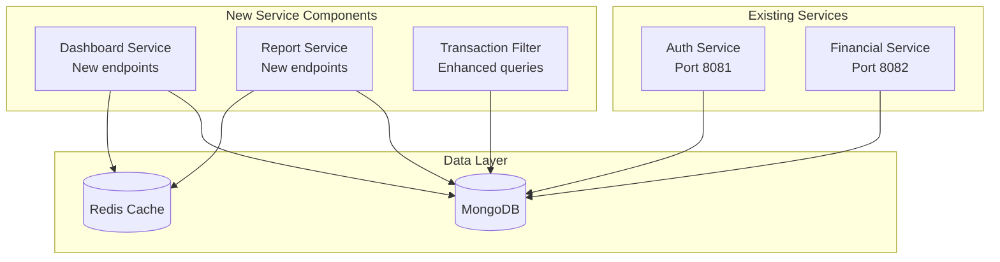
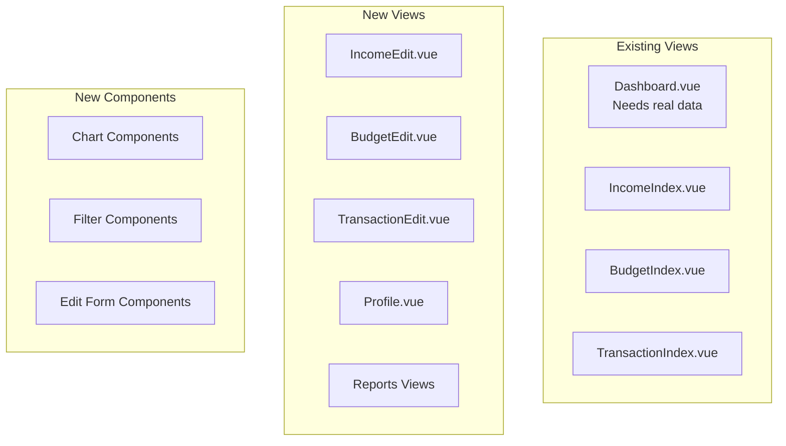

# Design Document: gSpend Completion

## Overview

This design document outlines the implementation approach for completing the gSpend family financial management application. The application currently has a solid foundation with:

**Current Architecture:**

- **Backend**: Go microservices (Auth Service on port 8081, Financial Service on port 8082)
- **Frontend**: Vue 3 with TypeScript, Pinia state management, and Tailwind-like styling
- **Database**: MongoDB with Redis caching
- **Infrastructure**: Docker containerization with Nginx API gateway
- **Communication**: REST APIs with gRPC for inter-service communication

**Existing Implementation Status:**

- ✅ Basic CRUD operations for budgets, income, transactions, categories
- ✅ JWT authentication and user management
- ✅ Dashboard service backend (implemented)
- ✅ Basic frontend views and components structure
- ✅ Database schemas and repositories

**Missing Components to Implement:**
This design focuses on implementing the missing core features: advanced reporting services, transaction filtering, budget analytics, comprehensive UI components with charts, user profile management, and production-ready error handling and performance optimizations.

The design leverages the existing MongoDB database schema and microservices architecture while adding the missing service layers, API endpoints, and frontend components needed for a complete family financial management experience.

## Architecture

The existing architecture will be extended with the following components:

### Backend Extensions



### Frontend Extensions



## Components and Interfaces

### Backend Components

#### Dashboard Service

**Location**: `apps/financial-service/internal/service/dashboard_service.go`

**Purpose**: Aggregate financial data for dashboard display

**Key Methods**:

- `GetDashboardSummary(userID string) (*DashboardSummary, error)`
- `GetRecentTransactions(userID string, limit int) ([]*Transaction, error)`
- `GetTopSpendingCategories(userID string, month time.Time) ([]*CategorySpending, error)`
- `GetCurrentMonthBudgetProgress(userID string) (*BudgetProgress, error)`

**Data Structures**:

```go
type DashboardSummary struct {
    TotalBalance     float64                `json:"total_balance"`
    MonthlyIncome    float64                `json:"monthly_income"`
    MonthlyExpenses  float64                `json:"monthly_expenses"`
    BudgetProgress   *BudgetProgress        `json:"budget_progress"`
    TopCategories    []*CategorySpending    `json:"top_categories"`
    RecentTransactions []*Transaction       `json:"recent_transactions"`
}

type BudgetProgress struct {
    TotalBudget      float64  `json:"total_budget"`
    TotalSpent       float64  `json:"total_spent"`
    RemainingBudget  float64  `json:"remaining_budget"`
    PercentageUsed   float64  `json:"percentage_used"`
}

type CategorySpending struct {
    CategoryID       string   `json:"category_id"`
    CategoryName     string   `json:"category_name"`
    Amount           float64  `json:"amount"`
    Percentage       float64  `json:"percentage"`
}
```

#### Report Service

**Location**: `apps/financial-service/internal/service/report_service.go`

**Purpose**: Generate financial reports and analytics (NEW - to be implemented)

**Key Methods**:

- `GetBudgetVsActualReport(userID string, month time.Time) (*BudgetVsActualReport, error)`
- `GetSpendingByCategoryReport(userID string, startDate, endDate time.Time) (*SpendingByCategoryReport, error)`
- `GetMonthlyTrendsReport(userID string, months int) (*MonthlyTrendsReport, error)`

**Data Structures**:

```go
type BudgetVsActualReport struct {
    Month            time.Time              `json:"month"`
    Categories       []*BudgetVsActualItem  `json:"categories"`
    TotalBudgeted    float64                `json:"total_budgeted"`
    TotalSpent       float64                `json:"total_spent"`
    OverallVariance  float64                `json:"overall_variance"`
}

type BudgetVsActualItem struct {
    CategoryName     string   `json:"category_name"`
    Budgeted         float64  `json:"budgeted"`
    Actual           float64  `json:"actual"`
    Variance         float64  `json:"variance"`
    PercentageUsed   float64  `json:"percentage_used"`
}

type SpendingByCategoryReport struct {
    StartDate        time.Time              `json:"start_date"`
    EndDate          time.Time              `json:"end_date"`
    Categories       []*CategorySpending    `json:"categories"`
    TotalSpent       float64                `json:"total_spent"`
}

type MonthlyTrendsReport struct {
    Months           int                    `json:"months"`
    MonthlyData      []*MonthlySpending     `json:"monthly_data"`
    AverageSpending  float64                `json:"average_spending"`
    TrendDirection   string                 `json:"trend_direction"` // "increasing", "decreasing", "stable"
}

type MonthlySpending struct {
    Month            time.Time              `json:"month"`
    TotalIncome      float64                `json:"total_income"`
    TotalExpenses    float64                `json:"total_expenses"`
    NetAmount        float64                `json:"net_amount"`
    TopCategory      *CategorySpending      `json:"top_category"`
}
```

#### Enhanced Transaction Repository

**Location**: `apps/financial-service/internal/repository/transaction_repository.go`

**Status**: Existing repository needs enhancement with new filtering methods

**New Methods to Add**:

- `FindWithFilters(userID string, filters TransactionFilters) ([]*Transaction, int, error)`
- `GetSpendingByCategory(userID string, startDate, endDate time.Time) ([]*CategorySpending, error)`
- `GetMonthlySpendingTrends(userID string, months int) ([]*MonthlySpending, error)`

**Filter Structure**:

```go
type TransactionFilters struct {
    StartDate    *time.Time `json:"start_date"`
    EndDate      *time.Time `json:"end_date"`
    CategoryID   *string    `json:"category_id"`
    Type         *string    `json:"type"` // "income" or "expense"
    Page         int        `json:"page"`
    PerPage      int        `json:"per_page"`
    SortBy       string     `json:"sort_by"` // "transaction_date" or "amount"
    SortOrder    string     `json:"sort_order"` // "asc" or "desc"
}
```

### Frontend Components

**Current Status**: Basic component structure exists, needs enhancement and new components

#### Chart Components

**Location**: `apps/frontend/src/components/charts/` (NEW - to be created)

**Components to Create**:

- `ProgressBar.vue` - Budget progress visualization
- `PieChart.vue` - Spending distribution
- `LineChart.vue` - Monthly trends
- `BarChart.vue` - Category comparisons

**Chart Library**: Chart.js with vue-chartjs wrapper (to be added)

#### Edit Form Components

**Location**: `apps/frontend/src/components/forms/` (NEW - to be created)

**Components to Create**:

- `IncomeEditForm.vue` - Edit income records
- `BudgetEditForm.vue` - Edit budget information
- `TransactionEditForm.vue` - Edit transaction details
- `ProfileEditForm.vue` - Edit user profile

#### Filter Components

**Location**: `apps/frontend/src/components/filters/` (NEW - to be created)

**Components to Create**:

- `DateRangeFilter.vue` - Date range selection
- `CategoryFilter.vue` - Category selection
- `TransactionTypeFilter.vue` - Income/expense toggle
- `QuickFilters.vue` - This month, last month, last 3 months

#### Enhanced Existing Views

**Locations**: `apps/frontend/src/views/*/` (EXISTING - to be enhanced)

**Views to Enhance**:

- `Dashboard.vue` - Connect to real dashboard API data
- `TransactionIndex.vue` - Add filtering and pagination
- `BudgetIndex.vue` - Add progress tracking and analytics
- `IncomeIndex.vue` - Add editing capabilities

**New Views to Create**:

- `Profile.vue` - User profile management
- `Reports/` directory with report views

## Data Models

### Enhanced API Response Models

#### Dashboard API Response

```json
{
  "success": true,
  "data": {
    "total_balance": 12450.00,
    "monthly_income": 8500.00,
    "monthly_expenses": 6200.00,
    "budget_progress": {
      "total_budget": 7000.00,
      "total_spent": 6200.00,
      "remaining_budget": 800.00,
      "percentage_used": 88.57
    },
    "top_categories": [
      {
        "category_id": "groceries",
        "category_name": "Groceries",
        "amount": 1200.00,
        "percentage": 19.35
      }
    ],
    "recent_transactions": [
      {
        "id": "trans_123",
        "amount": 85.50,
        "description": "Weekly groceries",
        "category_name": "Groceries",
        "transaction_date": "2024-01-15T10:30:00Z",
        "type": "expense"
      }
    ]
  }
}
```

#### Transaction List with Filters

```json
{
  "success": true,
  "data": {
    "transactions": [...],
    "pagination": {
      "page": 1,
      "per_page": 20,
      "total": 156,
      "total_pages": 8
    },
    "filters_applied": {
      "start_date": "2024-01-01",
      "end_date": "2024-01-31",
      "category_id": "groceries",
      "type": "expense"
    }
  }
}
```

### Database Enhancements

#### New Indexes for Performance

```javascript
// Compound index for transaction filtering
db.transactions.createIndex({ 
  userId: 1, 
  transactionDate: -1, 
  type: 1, 
  categoryId: 1 
})

// Index for dashboard aggregations
db.transactions.createIndex({ 
  userId: 1, 
  transactionDate: -1 
})

// Index for budget tracking
db.budgets.createIndex({ 
  userId: 1, 
  startDate: -1, 
  endDate: -1 
})
```

#### Category Seed Data Structure

```javascript
// Family-oriented categories for up to 5 children
const familyCategories = [
  // Housing & Utilities
  { name: "Rent/Mortgage", type: "expense", icon: "🏠", color: "#3B82F6", isSystem: true },
  { name: "Utilities", type: "expense", icon: "💡", color: "#EF4444", isSystem: true },
  
  // Food & Groceries
  { name: "Groceries", type: "expense", icon: "🛒", color: "#10B981", isSystem: true },
  { name: "Dining Out", type: "expense", icon: "🍽️", color: "#F59E0B", isSystem: true },
  
  // Children (up to 5)
  { name: "Childcare", type: "expense", icon: "👶", color: "#8B5CF6", isSystem: true },
  { name: "School Expenses", type: "expense", icon: "📚", color: "#06B6D4", isSystem: true },
  { name: "Kids Activities", type: "expense", icon: "🎨", color: "#EC4899", isSystem: true },
  { name: "Kids Clothing", type: "expense", icon: "👕", color: "#84CC16", isSystem: true },
  
  // Transportation
  { name: "Car Payment", type: "expense", icon: "🚗", color: "#6366F1", isSystem: true },
  { name: "Gas", type: "expense", icon: "⛽", color: "#EF4444", isSystem: true },
  
  // Healthcare
  { name: "Medical", type: "expense", icon: "🏥", color: "#DC2626", isSystem: true },
  { name: "Insurance", type: "expense", icon: "🛡️", color: "#059669", isSystem: true },
  
  // Income
  { name: "Salary", type: "income", icon: "💼", color: "#10B981", isSystem: true },
  { name: "Freelance", type: "income", icon: "💻", color: "#3B82F6", isSystem: true }
]
```

## Error Handling

### Error Response Format

```json
{
  "success": false,
  "error": {
    "code": "VALIDATION_ERROR",
    "message": "Please check the information you entered",
    "details": [
      {
        "field": "amount",
        "message": "Amount must be a positive number"
      },
      {
        "field": "category",
        "message": "Please select a category"
      }
    ]
  }
}
```

### Common Error Scenarios

1. **Invalid Amount**: Non-positive numbers, non-numeric input
2. **Missing Required Fields**: Empty category, description, or amount
3. **Date Validation**: Future dates for transactions, invalid date formats
4. **Budget Validation**: Budget total not matching sum of items
5. **Authentication**: Expired tokens, invalid credentials
6. **Not Found**: Attempting to edit non-existent records
7. **Permission**: Accessing other family's data

### Frontend Error Handling

- Toast notifications for user-friendly error messages
- Form validation with inline error display
- Retry mechanisms for network failures
- Graceful degradation when services are unavailable

## Testing Strategy

### Unit Testing

- **Backend**: Test service methods with mock repositories
- **Frontend**: Test Vue components with Vue Test Utils
- **Focus Areas**:

  - Dashboard aggregation calculations
  - Transaction filtering logic
  - Form validation
  - Chart data transformation

### Integration Testing

- **API Endpoints**: Test complete request/response cycles
- **Database Operations**: Test with real MongoDB instance
- **Authentication Flow**: Test JWT token validation
- **Cross-Service Communication**: Test Auth service integration

### Property-Based Testing

Property-based tests will validate universal properties that should hold across all valid inputs. Each property will be implemented using a Go property testing library (such as gopter) for backend tests and a JavaScript property testing library (such as fast-check) for frontend tests.

The properties will be derived from the acceptance criteria in the requirements document through systematic analysis of which criteria can be tested as universal properties versus specific examples.

## Correctness Properties

*A property is a characteristic or behavior that should hold true across all valid executions of a system-essentially, a formal statement about what the system should do. Properties serve as the bridge between human-readable specifications and machine-verifiable correctness guarantees.*

Based on the analysis of acceptance criteria, the following correctness properties must be validated through property-based testing:

### Property 1: Financial Balance Calculations

*For any* set of income and expense transactions, the total balance calculation should equal the sum of all income transactions minus the sum of all expense transactions
**Validates: Requirements 1.1, 1.2, 1.5, 10.2**

### Property 2: Transaction Filtering Consistency

*For any* set of transactions and filter criteria (date range, category, type), the filtered results should contain only transactions that match all specified criteria
**Validates: Requirements 2.4, 3.1, 3.2**

### Property 3: Category Aggregation Accuracy

*For any* set of transactions, when aggregated by category, the sum of all category totals should equal the total of all transactions
**Validates: Requirements 1.4, 2.1, 4.3**

### Property 4: Budget Tracking Calculations

*For any* budget and set of transactions, the spent amount for each budget category should equal the sum of all transactions in that category within the budget period
**Validates: Requirements 2.2, 4.4**

### Property 5: Pagination Consistency

*For any* large set of transactions, when paginated with 20 items per page, each page should contain exactly 20 items (except the last page) and no transaction should appear on multiple pages
**Validates: Requirements 3.3**

### Property 6: Transaction Sorting Order

*For any* set of transactions, when sorted by date in descending order, each transaction should have a date greater than or equal to the next transaction's date
**Validates: Requirements 3.5**

### Property 7: Recent Transactions Limit

*For any* set of transactions, requesting the last N recent transactions should return exactly N transactions (or fewer if less than N exist) ordered by date descending
**Validates: Requirements 1.3**

### Property 8: CRUD Operation Consistency

*For any* financial record (income, budget, transaction), after editing and saving changes, retrieving the record should return the updated values
**Validates: Requirements 3.4, 4.5, 7.1, 8.1, 8.2, 8.3**

### Property 9: Chart Data Percentage Accuracy

*For any* spending breakdown by category, the sum of all category percentages should equal 100% (within floating-point precision)
**Validates: Requirements 6.2**

### Property 10: Monthly Trend Aggregation

*For any* set of transactions across multiple months, the monthly aggregation should correctly group transactions by month and sum amounts within each month
**Validates: Requirements 2.3, 6.3**

### Property 11: Password Validation Rules

*For any* password string, the validation should accept passwords with 8+ characters containing at least one uppercase, one lowercase, and one number, and reject all others
**Validates: Requirements 7.3**

### Property 12: Amount Validation

*For any* monetary amount input, the system should accept positive numbers and reject zero, negative numbers, and non-numeric values
**Validates: Requirements 8.4, 9.4**

### Property 13: Required Field Validation

*For any* form submission with missing required fields, the system should identify and report all missing fields without processing the incomplete data
**Validates: Requirements 9.3**

### Property 14: Email Uniqueness Enforcement

*For any* email address, the system should allow only one user account to use that email address across all families
**Validates: Requirements 7.5**

### Property 15: Category System Protection

*For any* attempt to delete a category, the system should prevent deletion of system categories while allowing deletion of user-created custom categories
**Validates: Requirements 5.5**

### Property 16: Budget Progress Calculation

*For any* budget category with planned amount and actual spending, the progress percentage should equal (actual spending / planned amount) * 100
**Validates: Requirements 6.1**

### Property 17: Category Grouping Logic

*For any* set of categories, when grouped by type, each category should appear in exactly one group and all categories of the same type should be in the same group
**Validates: Requirements 5.4**

### Property 18: Custom Category Creation

*For any* valid category data (name, type, icon, color), the system should successfully create a custom category that can be retrieved and used for transactions
**Validates: Requirements 5.3**

### Property 19: Profile Update Validation

*For any* profile update with family size, the system should accept values from 0 to 5 children and reject values outside this range
**Validates: Requirements 7.1**

### Property 20: Password Change Security

*For any* password change request, the system should require and validate the current password before accepting the new password
**Validates: Requirements 7.2**

### Property 21: Mobile Responsiveness Validation

*For any* UI component, when rendered on screen widths below 768px, all interactive elements should remain accessible and readable
**Validates: Requirements 11.1, 11.2**

### Dual Testing Approach

The system will use both unit testing and property-based testing to ensure comprehensive coverage:

- **Unit tests**: Verify specific examples, edge cases, and error conditions
- **Property tests**: Verify universal properties across all inputs using randomized test data

### Property-Based Testing Configuration

- **Testing Library**: gopter for Go backend services, fast-check for TypeScript frontend
- **Test Iterations**: Minimum 100 iterations per property test
- **Test Tagging**: Each property test tagged with format: **Feature: gspend-completion, Property {number}: {property_text}**

### Unit Testing Focus Areas

- **Specific Examples**: Test known good/bad inputs with expected outputs
- **Edge Cases**: Empty datasets, boundary values, maximum limits
- **Error Conditions**: Invalid inputs, network failures, database errors
- **Integration Points**: API endpoint responses, database operations, authentication flows

### Test Coverage Requirements

- **Backend Services**: 80%+ code coverage on business logic
- **Frontend Components**: 70%+ coverage on component logic and user interactions
- **API Endpoints**: 100% coverage of all endpoints with success and error scenarios
- **Database Operations**: All CRUD operations tested with real MongoDB instance

### Testing Environment

- **Backend**: Go test framework with testify for assertions
- **Frontend**: Vitest for unit tests, Vue Test Utils for component testing
- **Integration**: Docker Compose test environment with MongoDB and Redis
- **Property Testing**: Automated generation of test data within realistic constraints
- **API Testing**: Postman/Newman collections for endpoint validation
- **E2E Testing**: Playwright or Cypress for complete user workflow testing

### Performance Testing

- **Load Testing**: Test with realistic family data volumes (hundreds of transactions)
- **Concurrent Users**: Validate system handles multiple family members simultaneously
- **Mobile Performance**: Ensure 2-second load times on mobile networks
- **Database Performance**: Monitor query performance with proper indexing
