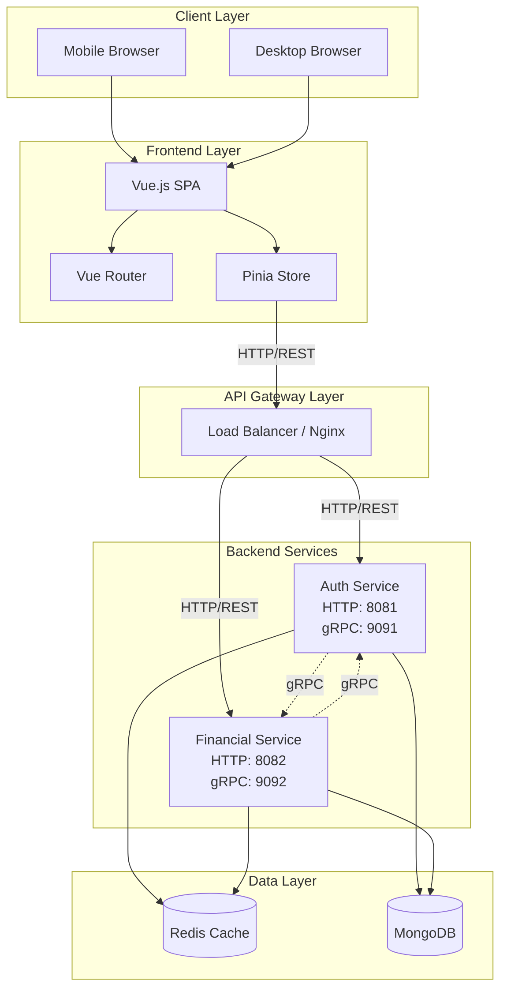
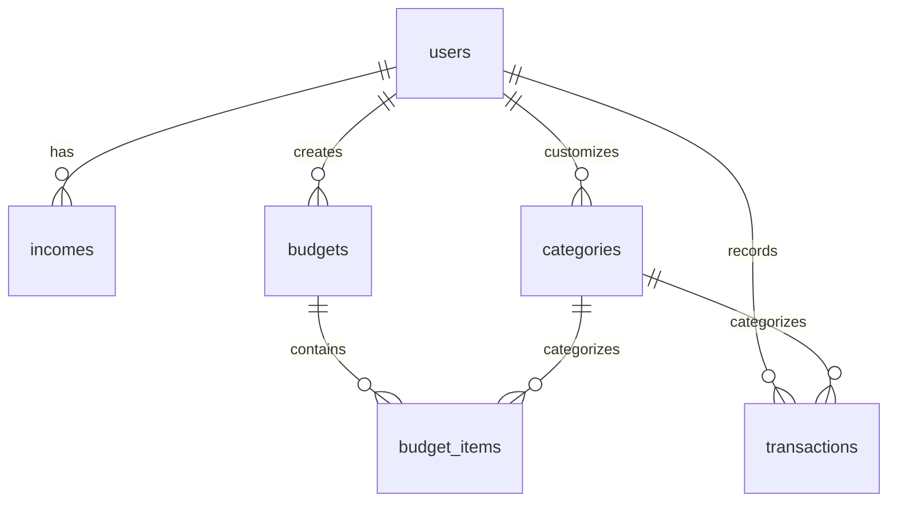
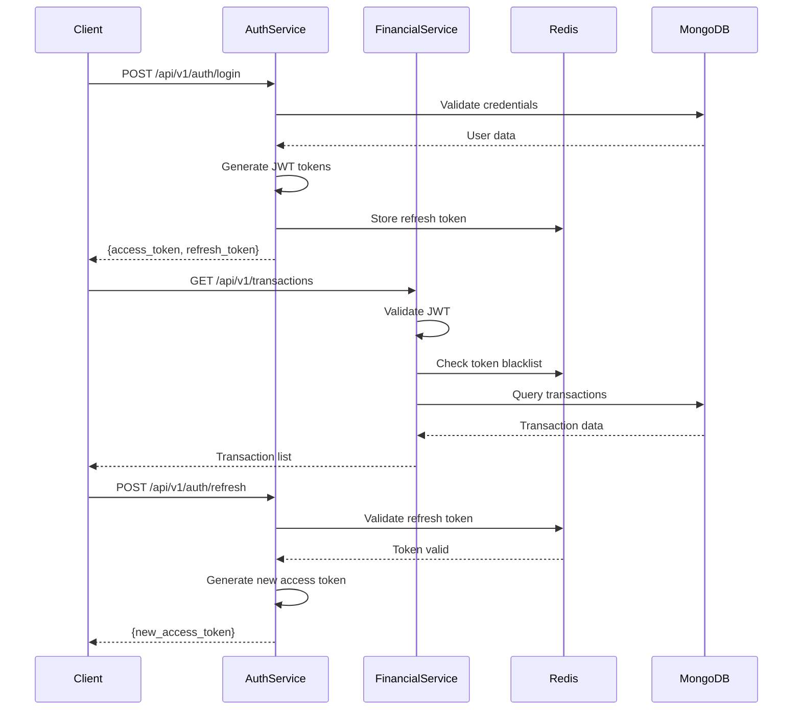

# Family Financial Management Application - Architecture & Design Document

## Executive Summary

This document outlines the comprehensive architecture and design for a responsive, mobile-first web application to manage family finances. The application will help families with 3 kids track income, plan budgets, monitor spending, and analyze transactions with temporal filtering capabilities.

**Architecture Approach**: Monorepo structure with simplified microservices (Auth + Financial Services), MongoDB database, and cloud-ready containerization.

---

## System Architecture

### High-Level Architecture



### Communication Protocols

#### External Communication (HTTP/REST)
- **Frontend → Nginx**: HTTP/REST
- **Nginx → Auth Service**: HTTP/REST (Port 8081)
- **Nginx → Financial Service**: HTTP/REST (Port 8082)
- **Purpose**: Client-facing APIs, RESTful endpoints

#### Inter-Service Communication (gRPC)
- **Auth Service ↔ Financial Service**: gRPC (Ports 9091 ↔ 9092)
- **Purpose**: High-performance internal service-to-service calls
- **Use Cases**:
  - User validation from Financial Service to Auth Service
  - User profile retrieval for enriching financial data
  - Centralized authentication checks

### Service Responsibilities

#### Auth Service
**HTTP Port**: 8081 (REST API for external clients)  
**gRPC Port**: 9091 (Inter-service communication)

**Purpose**: Handle all authentication and user management
- User registration and login (HTTP)
- JWT token generation and validation (HTTP + gRPC)
- Token refresh and revocation (HTTP)
- Password management (HTTP)
- User profile management (HTTP)
- Session management (HTTP + Redis)
- **gRPC Services**:
  - `ValidateToken(token)` - Validate JWT token
  - `GetUserProfile(userId)` - Get user profile by ID
  - `CheckUserExists(userId)` - Verify user exists

#### Financial Service
**HTTP Port**: 8082 (REST API for external clients)  
**gRPC Port**: 9092 (Inter-service communication)

**Purpose**: Handle all financial operations
- Income management (HTTP)
- Budget planning and tracking (HTTP)
- Transaction recording and queries (HTTP)
- Category management (HTTP)
- Dashboard and analytics (HTTP)
- Reports generation (HTTP)
- **Uses gRPC to call**:
  - Auth Service for token validation
  - Auth Service for user profile enrichment

### Technology Stack Details

#### Frontend Stack
- **Framework**: Vue.js 3 (Composition API)
- **State Management**: Pinia
- **Routing**: Vue Router 4
- **UI Components**: Tailwind CSS + HeadlessUI
- **HTTP Client**: Axios with interceptors
- **Form Validation**: VeeValidate
- **Date Handling**: Day.js
- **Charts**: Chart.js with vue-chartjs
- **Build Tool**: Vite
- **Icons**: Heroicons or Lucide

#### Backend Stack
- **Language**: Go 1.21+
- **Web Framework**: Echo v4 (for HTTP/REST)
- **RPC Framework**: gRPC with Protocol Buffers (for inter-service)
- **Proto Compiler**: protoc with Go plugins
- **Authentication**: JWT with golang-jwt
- **Database Driver**: MongoDB Go Driver (mongo-go-driver)
- **Validation**: go-playground/validator
- **Configuration**: Viper
- **Logging**: Zap (structured logging)
- **API Documentation**: Swagger/OpenAPI (HTTP), Proto files (gRPC)

#### Database & Caching
- **Primary Database**: MongoDB 7.x
- **Cache Layer**: Redis 7.x
- **Connection Pooling**: MongoDB connection pool + Redis client pool

#### DevOps & Infrastructure
- **Containerization**: Docker & Docker Compose
- **Orchestration**: Kubernetes-ready
- **CI/CD**: GitHub Actions
- **Reverse Proxy**: Nginx
- **Monitoring**: Prometheus + Grafana
- **Logging**: Centralized logging with Loki or ELK

---

## MongoDB Database Design

### Collections Overview



### Collection Schemas

#### users
```javascript
{
  _id: ObjectId,
  email: String, // unique index
  passwordHash: String,
  fullName: String,
  familySize: Number,
  createdAt: ISODate,
  updatedAt: ISODate,
  deletedAt: ISODate | null
}

// Indexes
db.users.createIndex({ email: 1 }, { unique: true })
db.users.createIndex({ deletedAt: 1 })
```

#### categories
```javascript
{
  _id: ObjectId,
  userId: ObjectId | null, // null for system categories
  name: String,
  type: String, // "expense" | "income"
  icon: String,
  color: String,
  isSystem: Boolean,
  sortOrder: Number,
  createdAt: ISODate,
  updatedAt: ISODate
}

// Indexes
db.categories.createIndex({ userId: 1, type: 1 })
db.categories.createIndex({ isSystem: 1 })
db.categories.createIndex({ userId: 1, sortOrder: 1 })
```

#### incomes
```javascript
{
  _id: ObjectId,
  userId: ObjectId,
  source: String,
  amount: Decimal128,
  frequency: String, // "one-time" | "daily" | "weekly" | "monthly" | "yearly"
  effectiveDate: ISODate,
  createdAt: ISODate,
  updatedAt: ISODate
}

// Indexes
db.incomes.createIndex({ userId: 1, effectiveDate: -1 })
db.incomes.createIndex({ userId: 1, frequency: 1 })
```

#### budgets
```javascript
{
  _id: ObjectId,
  userId: ObjectId,
  name: String,
  periodType: String, // "monthly" | "quarterly" | "yearly"
  startDate: ISODate,
  endDate: ISODate,
  totalAmount: Decimal128,
  items: [
    {
      _id: ObjectId,
      categoryId: ObjectId,
      categoryName: String, // denormalized for performance
      plannedAmount: Decimal128,
      spentAmount: Decimal128,
      notes: String
    }
  ],
  createdAt: ISODate,
  updatedAt: ISODate
}

// Indexes
db.budgets.createIndex({ userId: 1, startDate: -1, endDate: -1 })
db.budgets.createIndex({ userId: 1, periodType: 1 })
db.budgets.createIndex({ "items.categoryId": 1 })
```

#### transactions
```javascript
{
  _id: ObjectId,
  userId: ObjectId,
  categoryId: ObjectId,
  budgetId: ObjectId | null,
  type: String, // "income" | "expense"
  amount: Decimal128,
  description: String,
  transactionDate: ISODate,
  paymentMethod: String,
  notes: String,
  metadata: {
    categoryName: String, // denormalized
    budgetName: String    // denormalized
  },
  createdAt: ISODate,
  updatedAt: ISODate
}

// Indexes
db.transactions.createIndex({ userId: 1, transactionDate: -1 })
db.transactions.createIndex({ userId: 1, categoryId: 1 })
db.transactions.createIndex({ userId: 1, type: 1, transactionDate: -1 })
db.transactions.createIndex({ budgetId: 1 })
db.transactions.createIndex({ transactionDate: 1 })

// Compound index for filtering
db.transactions.createIndex({ 
  userId: 1, 
  transactionDate: -1, 
  type: 1, 
  categoryId: 1 
})
```

### MongoDB Design Patterns

1. **Embedded Documents**: Budget items are embedded within budgets for atomic updates and better query performance
2. **Denormalization**: Category names and budget names stored in transactions for faster reads
3. **Proper Indexing**: Compound indexes for common query patterns
4. **Decimal128**: Used for monetary values to maintain precision
5. **Soft Deletes**: deletedAt field for users to support data recovery

---

## API Endpoints Design

### Auth Service (Port 8081)

| Method | Endpoint | Description | Auth Required |
|--------|----------|-------------|---------------|
| POST | `/api/v1/auth/register` | Register new user | No |
| POST | `/api/v1/auth/login` | User login | No |
| POST | `/api/v1/auth/refresh` | Refresh JWT token | Yes (Refresh) |
| POST | `/api/v1/auth/logout` | Logout and invalidate token | Yes |
| GET | `/api/v1/auth/me` | Get current user profile | Yes |
| PUT | `/api/v1/auth/profile` | Update user profile | Yes |
| PUT | `/api/v1/auth/password` | Change password | Yes |
| GET | `/api/v1/auth/health` | Health check | No |

### Financial Service (Port 8082)

#### Income Management

| Method | Endpoint | Description | Auth Required |
|--------|----------|-------------|---------------|
| GET | `/api/v1/incomes` | List all incomes | Yes |
| POST | `/api/v1/incomes` | Create new income | Yes |
| GET | `/api/v1/incomes/:id` | Get income details | Yes |
| PUT | `/api/v1/incomes/:id` | Update income | Yes |
| DELETE | `/api/v1/incomes/:id` | Delete income | Yes |
| GET | `/api/v1/incomes/summary` | Get income summary | Yes |

#### Budget Planning

| Method | Endpoint | Description | Auth Required |
|--------|----------|-------------|---------------|
| GET | `/api/v1/budgets` | List all budgets | Yes |
| POST | `/api/v1/budgets` | Create new budget | Yes |
| GET | `/api/v1/budgets/:id` | Get budget details with items | Yes |
| PUT | `/api/v1/budgets/:id` | Update budget | Yes |
| DELETE | `/api/v1/budgets/:id` | Delete budget | Yes |
| GET | `/api/v1/budgets/current` | Get current active budget | Yes |
| POST | `/api/v1/budgets/:id/items` | Add budget item | Yes |
| PUT | `/api/v1/budgets/:id/items/:item_id` | Update budget item | Yes |
| DELETE | `/api/v1/budgets/:id/items/:item_id` | Delete budget item | Yes |

#### Transaction Management

| Method | Endpoint | Description | Auth Required |
|--------|----------|-------------|---------------|
| GET | `/api/v1/transactions` | List transactions with filters | Yes |
| POST | `/api/v1/transactions` | Create new transaction | Yes |
| GET | `/api/v1/transactions/:id` | Get transaction details | Yes |
| PUT | `/api/v1/transactions/:id` | Update transaction | Yes |
| DELETE | `/api/v1/transactions/:id` | Delete transaction | Yes |
| GET | `/api/v1/transactions/stats` | Get transaction statistics | Yes |

**Query Parameters for `/api/v1/transactions`:**
- `start_date`: Start date filter (YYYY-MM-DD)
- `end_date`: End date filter (YYYY-MM-DD)
- `category_id`: Filter by category
- `type`: Filter by type (income/expense)
- `period`: Predefined period (daily/monthly/yearly)
- `page`: Page number
- `per_page`: Items per page (max 100)
- `sort`: Sort field (transaction_date, amount)
- `order`: Sort order (asc/desc)

#### Category Management

| Method | Endpoint | Description | Auth Required |
|--------|----------|-------------|---------------|
| GET | `/api/v1/categories` | List all categories | Yes |
| POST | `/api/v1/categories` | Create custom category | Yes |
| GET | `/api/v1/categories/:id` | Get category details | Yes |
| PUT | `/api/v1/categories/:id` | Update category | Yes |
| DELETE | `/api/v1/categories/:id` | Delete category (custom only) | Yes |
| GET | `/api/v1/categories/system` | Get system categories | Yes |

#### Dashboard & Reports

| Method | Endpoint | Description | Auth Required |
|--------|----------|-------------|---------------|
| GET | `/api/v1/dashboard` | Get dashboard overview | Yes |
| GET | `/api/v1/reports/budget-vs-actual` | Budget vs actual report | Yes |
| GET | `/api/v1/reports/spending-by-category` | Spending by category | Yes |
| GET | `/api/v1/reports/monthly-trends` | Monthly trends report | Yes |
| GET | `/api/v1/health` | Health check | No |

---

## Pre-defined Budget Categories for Family with 3 Kids

### System Categories Collection Seed Data

#### Housing & Utilities (Expense)
- 🏠 Mortgage/Rent
- 💡 Electricity
- 💧 Water
- 🔥 Gas
- 🌐 Internet & Phone
- 🛠️ Home Maintenance

#### Food & Groceries (Expense)
- 🛒 Groceries
- 🍽️ Dining Out
- ☕ Coffee & Snacks
- 🍕 Fast Food
- 🎂 Special Occasions

#### Children & Education (Expense)
- 📚 School Tuition (Child 1)
- 📚 School Tuition (Child 2)
- 📚 School Tuition (Child 3)
- 📖 Books & Supplies
- 🎒 School Activities
- 👔 School Uniforms
- 🎓 Tutoring
- 🎨 Extracurricular Activities

#### Transportation (Expense)
- ⛽ Fuel
- 🚗 Car Payment
- 🔧 Car Maintenance
- 🚌 Public Transport
- 🅿️ Parking

#### Healthcare (Expense)
- 💊 Medical Expenses
- 🏥 Health Insurance
- 💉 Pharmacy
- 👓 Dental & Vision
- 🧘 Wellness

#### Childcare & Kids (Expense)
- 👶 Daycare
- 🎈 Kids Activities
- 🎮 Toys & Games
- 👕 Kids Clothing
- 🎁 Kids Allowance

#### Personal & Family (Expense)
- 👔 Adult Clothing
- 💇 Personal Care
- 🎁 Gifts
- 🎉 Entertainment
- 📱 Mobile Phones
- 💻 Electronics

#### Savings & Investments (Expense)
- 💰 Emergency Fund
- 🏦 Savings Account
- 📈 Investments
- 🎓 College Fund

#### Debt & Financial (Expense)
- 💳 Credit Card Payment
- 🏦 Loan Payment
- 📄 Insurance (Life, Property)

#### Miscellaneous (Expense)
- 🐕 Pets
- 🏋️ Fitness & Sports
- ✈️ Vacation & Travel
- 📦 Other Expenses

#### Income Categories
- 💼 Salary (Primary)
- 💼 Salary (Spouse)
- 💵 Freelance Income
- 🎁 Bonus
- 📊 Investment Returns
- 💰 Other Income

---

## Monorepo Structure

```
family-finance-app/
├── .github/
│   └── workflows/
│       ├── ci-frontend.yml
│       ├── ci-auth-service.yml
│       ├── ci-financial-service.yml
│       ├── proto-gen.yml
│       └── cd-deploy.yml
├── proto/
│   ├── auth/
│   │   └── v1/
│   │       └── auth.proto
│   ├── financial/
│   │   └── v1/
│   │       └── financial.proto
│   ├── buf.yaml
│   ├── buf.gen.yaml
│   ├── Makefile
│   └── README.md
├── apps/
│   ├── frontend/
│   │   ├── public/
│   │   │   ├── favicon.ico
│   │   │   └── index.html
│   │   ├── src/
│   │   │   ├── assets/
│   │   │   │   ├── images/
│   │   │   │   ├── icons/
│   │   │   │   └── styles/
│   │   │   │       ├── main.css
│   │   │   │       └── tailwind.css
│   │   │   ├── components/
│   │   │   │   ├── common/
│   │   │   │   │   ├── Button.vue
│   │   │   │   │   ├── Input.vue
│   │   │   │   │   ├── Modal.vue
│   │   │   │   │   ├── Card.vue
│   │   │   │   │   └── Loading.vue
│   │   │   │   ├── layout/
│   │   │   │   │   ├── Header.vue
│   │   │   │   │   ├── Sidebar.vue
│   │   │   │   │   ├── Footer.vue
│   │   │   │   │   └── MobileNav.vue
│   │   │   │   ├── income/
│   │   │   │   │   ├── IncomeList.vue
│   │   │   │   │   ├── IncomeForm.vue
│   │   │   │   │   └── IncomeSummary.vue
│   │   │   │   ├── budget/
│   │   │   │   │   ├── BudgetList.vue
│   │   │   │   │   ├── BudgetForm.vue
│   │   │   │   │   ├── BudgetItemForm.vue
│   │   │   │   │   └── BudgetProgress.vue
│   │   │   │   ├── transaction/
│   │   │   │   │   ├── TransactionList.vue
│   │   │   │   │   ├── TransactionForm.vue
│   │   │   │   │   ├── TransactionFilter.vue
│   │   │   │   │   └── TransactionStats.vue
│   │   │   │   ├── category/
│   │   │   │   │   ├── CategoryList.vue
│   │   │   │   │   ├── CategoryForm.vue
│   │   │   │   │   └── CategoryIcon.vue
│   │   │   │   └── dashboard/
│   │   │   │       ├── DashboardOverview.vue
│   │   │   │       ├── BudgetChart.vue
│   │   │   │       ├── SpendingChart.vue
│   │   │   │       └── TrendChart.vue
│   │   │   ├── composables/
│   │   │   │   ├── useAuth.js
│   │   │   │   ├── useApi.js
│   │   │   │   ├── useFilter.js
│   │   │   │   └── useToast.js
│   │   │   ├── layouts/
│   │   │   │   ├── AuthLayout.vue
│   │   │   │   ├── MainLayout.vue
│   │   │   │   └── EmptyLayout.vue
│   │   │   ├── router/
│   │   │   │   ├── index.js
│   │   │   │   └── guards.js
│   │   │   ├── stores/
│   │   │   │   ├── auth.js
│   │   │   │   ├── income.js
│   │   │   │   ├── budget.js
│   │   │   │   ├── transaction.js
│   │   │   │   ├── category.js
│   │   │   │   └── dashboard.js
│   │   │   ├── services/
│   │   │   │   ├── api.js
│   │   │   │   ├── auth.service.js
│   │   │   │   ├── income.service.js
│   │   │   │   ├── budget.service.js
│   │   │   │   ├── transaction.service.js
│   │   │   │   └── category.service.js
│   │   │   ├── utils/
│   │   │   │   ├── formatters.js
│   │   │   │   ├── validators.js
│   │   │   │   ├── constants.js
│   │   │   │   └── helpers.js
│   │   │   ├── views/
│   │   │   │   ├── auth/
│   │   │   │   │   ├── Login.vue
│   │   │   │   │   ├── Register.vue
│   │   │   │   │   └── Profile.vue
│   │   │   │   ├── income/
│   │   │   │   │   ├── IncomeIndex.vue
│   │   │   │   │   ├── IncomeCreate.vue
│   │   │   │   │   └── IncomeEdit.vue
│   │   │   │   ├── budget/
│   │   │   │   │   ├── BudgetIndex.vue
│   │   │   │   │   ├── BudgetCreate.vue
│   │   │   │   │   ├── BudgetEdit.vue
│   │   │   │   │   └── BudgetDetail.vue
│   │   │   │   ├── transaction/
│   │   │   │   │   ├── TransactionIndex.vue
│   │   │   │   │   ├── TransactionCreate.vue
│   │   │   │   │   └── TransactionEdit.vue
│   │   │   │   ├── category/
│   │   │   │   │   └── CategoryIndex.vue
│   │   │   │   ├── dashboard/
│   │   │   │   │   └── Dashboard.vue
│   │   │   │   └── reports/
│   │   │   │       ├── BudgetVsActual.vue
│   │   │   │       ├── SpendingByCategory.vue
│   │   │   │       └── MonthlyTrends.vue
│   │   │   ├── App.vue
│   │   │   └── main.js
│   │   ├── .env.development
│   │   ├── .env.production
│   │   ├── .gitignore
│   │   ├── package.json
│   │   ├── vite.config.js
│   │   ├── tailwind.config.js
│   │   ├── postcss.config.js
│   │   ├── Dockerfile
│   │   ├── nginx.conf
│   │   └── README.md
│   │
│   ├── auth-service/
│   │   ├── cmd/
│   │   │   └── server/
│   │   │       └── main.go
│   │   ├── internal/
│   │   │   ├── config/
│   │   │   │   └── config.go
│   │   │   ├── domain/
│   │   │   │   └── user.go
│   │   │   ├── repository/
│   │   │   │   └── user_repository.go
│   │   │   ├── service/
│   │   │   │   └── auth_service.go
│   │   │   ├── grpc/
│   │   │   │   ├── server.go
│   │   │   │   └── auth_grpc_service.go
│   │   │   ├── handler/
│   │   │   │   └── auth_handler.go
│   │   │   ├── middleware/
│   │   │   │   ├── auth.go
│   │   │   │   ├── cors.go
│   │   │   │   ├── logger.go
│   │   │   │   └── error.go
│   │   │   ├── dto/
│   │   │   │   └── auth_dto.go
│   │   │   └── util/
│   │   │       ├── jwt.go
│   │   │       ├── password.go
│   │   │       ├── response.go
│   │   │       └── validator.go
│   │   ├── pkg/
│   │   │   ├── proto/
│   │   │   │   └── auth/
│   │   │   │       └── v1/
│   │   │   │           ├── auth.pb.go
│   │   │   │           └── auth_grpc.pb.go
│   │   │   ├── database/
│   │   │   │   ├── mongodb.go
│   │   │   │   └── redis.go
│   │   │   └── logger/
│   │   │       └── logger.go
│   │   ├── .env.example
│   │   ├── .gitignore
│   │   ├── go.mod
│   │   ├── go.sum
│   │   ├── Dockerfile
│   │   └── README.md
│   │
│   └── financial-service/
│       ├── cmd/
│       │   └── server/
│       │       └── main.go
│       ├── internal/
│       │   ├── config/
│       │   │   └── config.go
│       │   ├── domain/
│       │   │   ├── income.go
│       │   │   ├── budget.go
│       │   │   ├── transaction.go
│       │   │   └── category.go
│       │   ├── repository/
│       │   │   ├── income_repository.go
│       │   │   ├── budget_repository.go
│       │   │   ├── transaction_repository.go
│       │   │   └── category_repository.go
│       │   ├── service/
│       │   │   ├── income_service.go
│       │   │   ├── budget_service.go
│       │   │   ├── transaction_service.go
│       │   │   ├── category_service.go
│       │   │   └── dashboard_service.go
│       │   ├── handler/
│       │   │   ├── income_handler.go
│       │   │   ├── budget_handler.go
│       │   │   ├── transaction_handler.go
│       │   │   ├── category_handler.go
│       │   │   └── dashboard_handler.go
│       │   ├── middleware/
│       │   │   ├── auth.go
│       │   │   ├── cors.go
│       │   │   ├── logger.go
│       │   │   └── error.go
│       │   ├── dto/
│       │   │   ├── income_dto.go
│       │   │   ├── budget_dto.go
│       │   │   ├── transaction_dto.go
│       │   │   └── category_dto.go
│       │   └── util/
│       │       ├── jwt.go
│       │       ├── response.go
│       │       └── validator.go
│       ├── pkg/
│       │   ├── database/
│       │   │   ├── mongodb.go
│       │   │   └── redis.go
│       │   └── logger/
│       │       └── logger.go
│       ├── scripts/
│       │   └── seed-categories.go
│       ├── .env.example
│       ├── .gitignore
│       ├── go.mod
│       ├── go.sum
│       ├── Dockerfile
│       └── README.md
│
├── devops/
│   ├── docker/
│   │   ├── docker-compose.yml
│   │   ├── docker-compose.dev.yml
│   │   └── docker-compose.prod.yml
│   ├── kubernetes/
│   │   ├── namespace.yaml
│   │   ├── configmaps/
│   │   │   ├── frontend-config.yaml
│   │   │   ├── auth-service-config.yaml
│   │   │   └── financial-service-config.yaml
│   │   ├── secrets/
│   │   │   └── app-secrets.yaml
│   │   ├── deployments/
│   │   │   ├── frontend-deployment.yaml
│   │   │   ├── auth-service-deployment.yaml
│   │   │   ├── financial-service-deployment.yaml
│   │   │   ├── mongodb-deployment.yaml
│   │   │   └── redis-deployment.yaml
│   │   ├── services/
│   │   │   ├── frontend-service.yaml
│   │   │   ├── auth-service.yaml
│   │   │   ├── financial-service.yaml
│   │   │   ├── mongodb-service.yaml
│   │   │   └── redis-service.yaml
│   │   ├── ingress/
│   │   │   └── ingress.yaml
│   │   └── volumes/
│   │       ├── mongodb-pvc.yaml
│   │       └── redis-pvc.yaml
│   ├── nginx/
│   │   ├── nginx.conf
│   │   └── ssl/
│   ├── monitoring/
│   │   ├── prometheus/
│   │   │   └── prometheus.yml
│   │   └── grafana/
│   │       └── dashboards/
│   └── scripts/
│       ├── deploy.sh
│       ├── rollback.sh
│       └── health-check.sh
│
├── docs/
│   ├── api/
│   │   ├── auth-service-api.md
│   │   └── financial-service-api.md
│   ├── architecture/
│   │   ├── system-design.md
│   │   └── database-schema.md
│   ├── deployment/
│   │   ├── local-setup.md
│   │   ├── docker-deployment.md
│   │   └── kubernetes-deployment.md
│   └── development/
│       ├── contributing.md
│       ├── coding-standards.md
│       └── testing-guide.md
│
├── .gitignore
├── .editorconfig
├── README.md
├── LICENSE
└── CHANGELOG.md
```

---

## Containerization & Deployment

### Docker Compose Configuration

#### docker-compose.yml (Development & Production)
```yaml
version: '3.8'

services:
  # Frontend
  frontend:
    build:
      context: ./apps/frontend
      dockerfile: Dockerfile
      target: ${BUILD_TARGET:-production}
    ports:
      - "${FRONTEND_PORT:-3000}:80"
    environment:
      - VITE_AUTH_SERVICE_URL=http://auth-service:8081
      - VITE_FINANCIAL_SERVICE_URL=http://financial-service:8082
    depends_on:
      - auth-service
      - financial-service
    networks:
      - family-finance-net
    restart: unless-stopped

  # Auth Service
  auth-service:
    build:
      context: ./apps/auth-service
      dockerfile: Dockerfile
    ports:
      - "${AUTH_SERVICE_PORT:-8081}:8081"
    environment:
      - MONGODB_URI=mongodb://mongodb:27017
      - MONGODB_DATABASE=family_finance
      - REDIS_HOST=redis
      - REDIS_PORT=6379
      - JWT_SECRET=${JWT_SECRET:-your-secret-key-change-in-production}
      - JWT_REFRESH_SECRET=${JWT_REFRESH_SECRET:-your-refresh-secret-key}
      - APP_ENV=${APP_ENV:-production}
      - PORT=8081
    depends_on:
      mongodb:
        condition: service_healthy
      redis:
        condition: service_healthy
    networks:
      - family-finance-net
    restart: unless-stopped
    healthcheck:
      test: ["CMD", "wget", "--quiet", "--tries=1", "--spider", "http://localhost:8081/api/v1/auth/health"]
      interval: 30s
      timeout: 10s
      retries: 3
      start_period: 40s

  # Financial Service
  financial-service:
    build:
      context: ./apps/financial-service
      dockerfile: Dockerfile
    ports:
      - "${FINANCIAL_SERVICE_PORT:-8082}:8082"
    environment:
      - MONGODB_URI=mongodb://mongodb:27017
      - MONGODB_DATABASE=family_finance
      - REDIS_HOST=redis
      - REDIS_PORT=6379
      - JWT_SECRET=${JWT_SECRET:-your-secret-key-change-in-production}
      - APP_ENV=${APP_ENV:-production}
      - PORT=8082
      - AUTH_SERVICE_URL=http://auth-service:8081
    depends_on:
      mongodb:
        condition: service_healthy
      redis:
        condition: service_healthy
    networks:
      - family-finance-net
    restart: unless-stopped
    healthcheck:
      test: ["CMD", "wget", "--quiet", "--tries=1", "--spider", "http://localhost:8082/api/v1/health"]
      interval: 30s
      timeout: 10s
      retries: 3
      start_period: 40s

  # MongoDB Database
  mongodb:
    image: mongo:7
    ports:
      - "${MONGODB_PORT:-27017}:27017"
    environment:
      - MONGO_INITDB_ROOT_USERNAME=${MONGO_ROOT_USER:-admin}
      - MONGO_INITDB_ROOT_PASSWORD=${MONGO_ROOT_PASSWORD:-adminpassword}
      - MONGO_INITDB_DATABASE=family_finance
    volumes:
      - mongodb-data:/data/db
      - mongodb-config:/data/configdb
    healthcheck:
      test: ["CMD", "mongosh", "--eval", "db.adminCommand('ping')"]
      interval: 10s
      timeout: 5s
      retries: 5
      start_period: 30s
    networks:
      - family-finance-net
    restart: unless-stopped

  # Redis Cache
  redis:
    image: redis:7-alpine
    ports:
      - "${REDIS_PORT:-6379}:6379"
    command: redis-server --appendonly yes --requirepass ${REDIS_PASSWORD:-redispassword}
    volumes:
      - redis-data:/data
    healthcheck:
      test: ["CMD", "redis-cli", "--raw", "incr", "ping"]
      interval: 5s
      timeout: 3s
      retries: 5
      start_period: 10s
    networks:
      - family-finance-net
    restart: unless-stopped

  # Nginx Reverse Proxy
  nginx:
    image: nginx:alpine
    ports:
      - "${HTTP_PORT:-80}:80"
      - "${HTTPS_PORT:-443}:443"
    volumes:
      - ./devops/nginx/nginx.conf:/etc/nginx/nginx.conf:ro
      - ./devops/nginx/ssl:/etc/nginx/ssl:ro
    depends_on:
      - frontend
      - auth-service
      - financial-service
    networks:
      - family-finance-net
    restart: unless-stopped

networks:
  family-finance-net:
    driver: bridge

volumes:
  mongodb-data:
    driver: local
  mongodb-config:
    driver: local
  redis-data:
    driver: local
```

#### Nginx Configuration (devops/nginx/nginx.conf)
```nginx
events {
    worker_connections 1024;
}

http {
    upstream frontend {
        server frontend:80;
    }

    upstream auth_service {
        server auth-service:8081;
    }

    upstream financial_service {
        server financial-service:8082;
    }

    server {
        listen 80;
        server_name localhost;

        # Frontend
        location / {
            proxy_pass http://frontend;
            proxy_set_header Host $host;
            proxy_set_header X-Real-IP $remote_addr;
            proxy_set_header X-Forwarded-For $proxy_add_x_forwarded_for;
            proxy_set_header X-Forwarded-Proto $scheme;
        }

        # Auth Service
        location /api/v1/auth {
            proxy_pass http://auth_service;
            proxy_set_header Host $host;
            proxy_set_header X-Real-IP $remote_addr;
            proxy_set_header X-Forwarded-For $proxy_add_x_forwarded_for;
            proxy_set_header X-Forwarded-Proto $scheme;
        }

        # Financial Service
        location /api/v1 {
            proxy_pass http://financial_service;
            proxy_set_header Host $host;
            proxy_set_header X-Real-IP $remote_addr;
            proxy_set_header X-Forwarded-For $proxy_add_x_forwarded_for;
            proxy_set_header X-Forwarded-Proto $scheme;
        }
    }
}
```

---

## Security & Authentication

### JWT Authentication Flow



### Inter-Service Communication

Both services (Auth and Financial) share the same JWT secret for token validation. The Financial Service validates tokens independently without calling the Auth Service for better performance.

### Security Features

1. **Authentication**
   - JWT-based authentication with RS256 or HS256
   - Secure password hashing (bcrypt, cost 12)
   - Refresh token rotation
   - Token blacklisting on logout (Redis)
   - Access token TTL: 15 minutes
   - Refresh token TTL: 7 days

2. **Authorization**
   - User ID extraction from JWT claims
   - Resource ownership validation
   - API rate limiting (per user/IP)

3. **Data Protection**
   - HTTPS/TLS encryption (production)
   - MongoDB connection with auth
   - Redis password protection
   - Input validation and sanitization
   - XSS protection
   - CSRF protection for state-changing operations
   - SQL/NoSQL injection prevention

4. **Infrastructure Security**
   - Environment variable management
   - Docker secrets for sensitive data
   - Network isolation (Docker networks)
   - Least privilege principle

---

## Caching Strategy (Redis)

### Cache Keys Structure
```
auth:user:{user_id}:profile
auth:token:blacklist:{token_jti}
auth:refresh:{refresh_token_id}

finance:user:{user_id}:categories
finance:user:{user_id}:incomes
finance:user:{user_id}:budgets:current
finance:user:{user_id}:transactions:{year}:{month}
finance:user:{user_id}:dashboard
finance:stats:{user_id}:{period}
```

### Cache TTL Strategy
- User profile: 1 hour
- Categories: 24 hours
- Current budget: 30 minutes
- Dashboard data: 5 minutes
- Transaction lists: 10 minutes
- Blacklisted tokens: Until token expiry
- Refresh tokens: 7 days

### Cache Invalidation
- **Event-based**: Clear cache on data modification
  - On transaction create/update/delete → Clear transaction cache
  - On budget update → Clear budget and dashboard cache
  - On category change → Clear category cache
  - On income change → Clear income and dashboard cache

---

## API Response Format

### Success Response
```json
{
  "success": true,
  "data": {
    // Response data
  },
  "meta": {
    "page": 1,
    "perPage": 20,
    "total": 100,
    "totalPages": 5
  }
}
```

### Error Response
```json
{
  "success": false,
  "error": {
    "code": "VALIDATION_ERROR",
    "message": "Validation failed",
    "details": [
      {
        "field": "amount",
        "message": "Amount must be greater than 0"
      }
    ]
  }
}
```

---

## Development Guidelines

### Monorepo Management

#### Workspace Commands
```bash
# Install all dependencies
npm install

# Run specific app
npm run dev:frontend
npm run dev:auth
npm run dev:financial

# Build all apps
npm run build

# Test all apps
npm run test

# Lint
npm run lint
```

### Frontend Development (Vue.js)

#### Component Structure
```vue
<template>
  <!-- Template -->
</template>

<script setup>
// Imports
// Composables
// Props & Emits
// State
// Computed
// Methods
// Lifecycle hooks
</script>

<style scoped>
/* Component styles */
</style>
```

#### API Service Configuration
```javascript
// services/api.js
import axios from 'axios'

const authApi = axios.create({
  baseURL: import.meta.env.VITE_AUTH_SERVICE_URL
})

const financialApi = axios.create({
  baseURL: import.meta.env.VITE_FINANCIAL_SERVICE_URL
})

export { authApi, financialApi }
```

### Backend Development (Golang)

#### Project Structure Pattern
Each service follows Clean Architecture:
- **Domain**: Business entities
- **Repository**: Data access layer
- **Service**: Business logic
- **Handler**: HTTP handlers
- **Middleware**: Cross-cutting concerns

#### MongoDB Connection Example
```go
// pkg/database/mongodb.go
func NewMongoClient(uri string) (*mongo.Client, error) {
    ctx, cancel := context.WithTimeout(context.Background(), 10*time.Second)
    defer cancel()
    
    client, err := mongo.Connect(ctx, options.Client().ApplyURI(uri))
    if err != nil {
        return nil, err
    }
    
    return client, nil
}
```

### Git Workflow

#### Branch Strategy
- `main`: Production-ready code
- `develop`: Integration branch
- `feature/*`: Feature branches
- `bugfix/*`: Bug fixes
- `hotfix/*`: Production hotfixes

#### Commit Convention
```
feat(auth): add user registration endpoint
feat(financial): implement budget tracking
fix(frontend): correct date picker timezone issue
docs: update API documentation
style: format code with prettier
refactor(auth): simplify JWT validation
test(financial): add transaction service tests
chore: update dependencies
```

---

## Testing Strategy

### Frontend Testing
1. **Unit Tests**: Vitest for components and composables
2. **Integration Tests**: Test user flows
3. **E2E Tests**: Playwright for critical paths
4. **Coverage Target**: 80%+

### Backend Testing
1. **Unit Tests**: Go test for services and utilities
2. **Integration Tests**: API endpoints with test MongoDB
3. **Load Tests**: k6 for performance testing
4. **Coverage Target**: 80%+

```go
// Example test
func TestCreateTransaction(t *testing.T) {
    // Setup test database
    // Create test data
    // Execute service method
    // Assert results
}
```

---

## CI/CD Pipeline

### GitHub Actions Workflow

#### Frontend CI
```yaml
name: Frontend CI

on:
  push:
    paths:
      - 'apps/frontend/**'
  pull_request:
    paths:
      - 'apps/frontend/**'

jobs:
  test:
    runs-on: ubuntu-latest
    steps:
      - uses: actions/checkout@v3
      - uses: actions/setup-node@v3
      - run: cd apps/frontend && npm ci
      - run: cd apps/frontend && npm run lint
      - run: cd apps/frontend && npm run test
      - run: cd apps/frontend && npm run build
```

#### Backend Services CI
```yaml
name: Auth Service CI

on:
  push:
    paths:
      - 'apps/auth-service/**'
  pull_request:
    paths:
      - 'apps/auth-service/**'

jobs:
  test:
    runs-on: ubuntu-latest
    steps:
      - uses: actions/checkout@v3
      - uses: actions/setup-go@v4
        with:
          go-version: '1.21'
      - run: cd apps/auth-service && go test ./...
      - run: cd apps/auth-service && go build ./cmd/server
```

---

## Performance Optimization

### Frontend
- Code splitting by route
- Lazy loading components
- Image optimization
- Progressive Web App (PWA) support
- Service Worker for offline mode
- Browser caching
- Gzip/Brotli compression

### Backend
- MongoDB index optimization
- Connection pooling
- Redis caching layer
- Goroutine concurrency
- Response compression
- API pagination
- Query optimization

### Database
- Proper indexing strategy
- Compound indexes for common queries
- Aggregation pipeline optimization
- Read preference configuration
- Write concern optimization

---

## Monitoring & Logging

### Application Metrics
- Request rate, duration, errors
- Database query performance
- Cache hit/miss ratio
- Service health status
- Resource usage (CPU, Memory)

### Logging Strategy
```go
// Structured logging with Zap
logger.Info("User logged in",
    zap.String("user_id", userID),
    zap.String("ip", clientIP),
    zap.Duration("duration", duration),
)
```

### Health Checks
- `/api/v1/auth/health` - Auth service health
- `/api/v1/health` - Financial service health
- Database connectivity check
- Redis connectivity check

---

## Scalability Considerations

### Horizontal Scaling
- Stateless service design
- Load balancer (Nginx)
- Multiple service instances
- Session data in Redis
- MongoDB replica set

### Cloud Deployment Architecture
```
Internet → Load Balancer → [Frontend Pods]
                        → [Auth Service Pods] → MongoDB Cluster
                        → [Financial Service Pods] → Redis Cluster
```

### Kubernetes Deployment
- Deployments for each service
- Horizontal Pod Autoscaler (HPA)
- Persistent Volume Claims (PVC) for databases
- ConfigMaps and Secrets for configuration
- Ingress for external access

---

## Estimated Timeline

### Phase 1: Foundation (2-3 weeks)
- Monorepo setup
- Docker environment
- MongoDB schema setup
- Auth service implementation
- Basic JWT authentication

### Phase 2: Financial Core (3-4 weeks)
- Financial service implementation
- Income management
- Budget planning
- Transaction management
- Category system with seed data

### Phase 3: Frontend (2-3 weeks)
- Vue.js application setup
- Authentication UI
- Financial management UI
- Dashboard and reports
- Mobile-first responsive design

### Phase 4: Integration & Testing (2 weeks)
- Service integration
- End-to-end testing
- Performance testing
- Bug fixes

### Phase 5: DevOps & Deployment (1 week)
- CI/CD pipeline
- Kubernetes manifests
- Production deployment
- Monitoring setup

**Total Estimated Time**: 10-13 weeks

---

## Next Steps

1. **Review Architecture**: Approve this refined design
2. **Initialize Monorepo**: Set up project structure
3. **Setup Development Environment**: Docker Compose for local development
4. **Begin Implementation**: Start with Auth Service
5. **Iterative Development**: Build, test, deploy in sprints

## Conclusion

This refined architecture provides:
- ✅ **Simplified Services**: 2 backend services (Auth + Financial)
- ✅ **NoSQL Database**: MongoDB for flexible schema and scalability
- ✅ **Monorepo Structure**: All codebases in one repository
- ✅ **Cloud-Ready**: Containerized and Kubernetes-ready
- ✅ **Production-Grade**: Security, caching, monitoring, and CI/CD

The architecture is maintainable, scalable, and follows modern best practices for microservices development.
